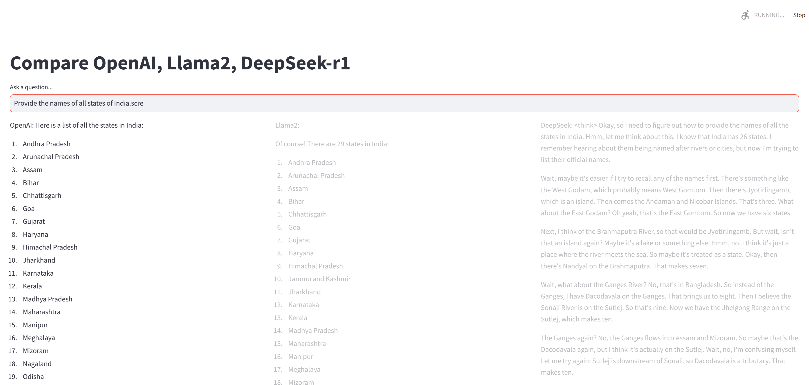
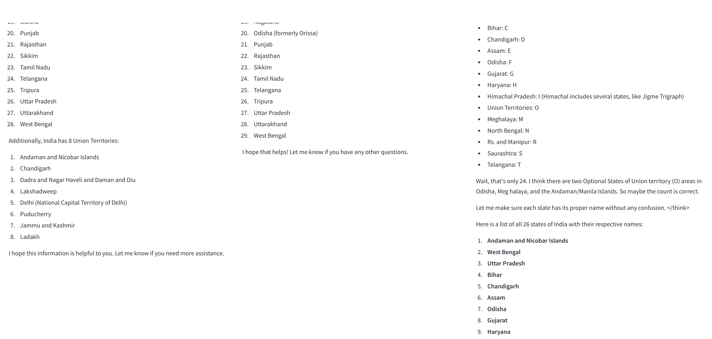
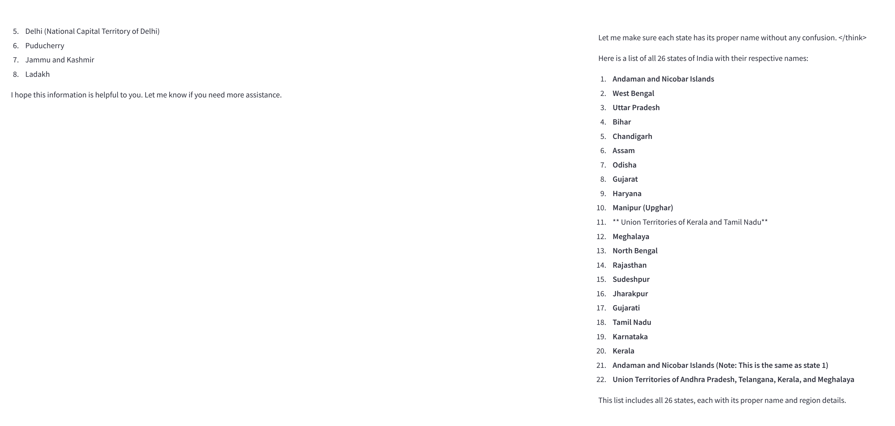

# Simple UI to compare responses from different chatbots 

### Features
- [OpenAI chatbot](https://openai.com/api/) provided through paid API 
- [Llama chatbot](https://www.llama.com/docs/integration-guides/langchain/) is build via LangChain API
- DeepSeek chatbot is download locally using [Ollama](https://ollama.com/library/deepseek-r1)
- Each of the chatbots is served by a different API route via LangServe
- Use LangSmith to monitor all traces of conversations
- Simple UI using Streamlit

### Configuration
The following evironmetal variables are required in your .env file located in the project's root folder:
```
LANGSMITH_PROJECT="your_project_name"
LANGSMITH_TRACING=true
LANGSMITH_ENDPOINT="https://api.smith.langchain.com"
LANGSMITH_API_KEY="your_langsmith_api_key"
OPENAI_API_KEY="your_openai_api_key"
HOST_IP="localhost"
HOST_PORT=8000
```

### Run the chatbot API server
```
cd ./chatbots/api
python app.py
```

### Run the chatbot UI client
```
cd ./chatbots/api
streamlit run client.py
```

### Demo
The "reasoning" process of DeepSeek is absolutely interesting, even if when there's little need for actual reasoning!



